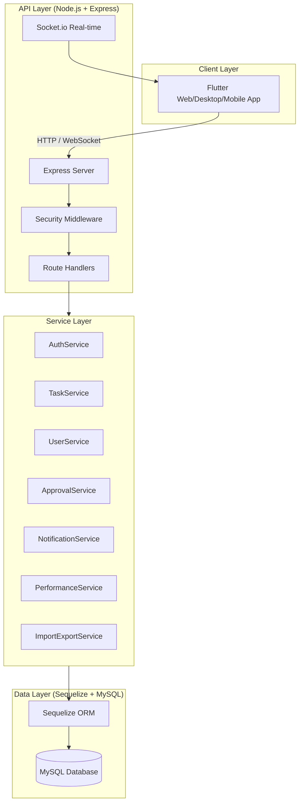
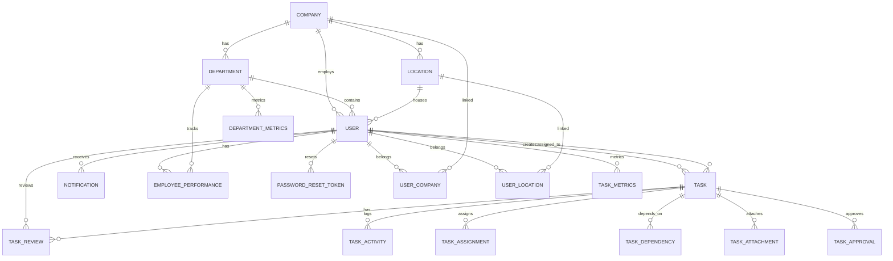
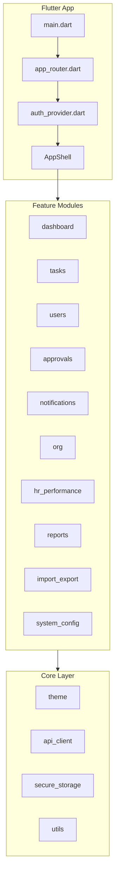
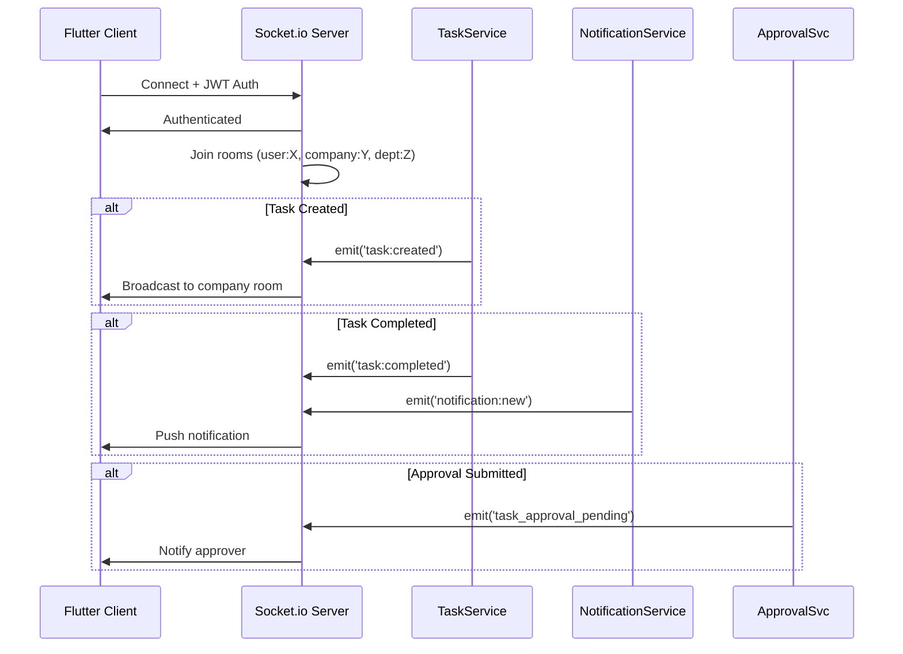

# Studioinfinito — Code Architecture & Graph

> Auto-generated comprehensive architecture documentation for the TSI Task Manager.

---

## 1. High-Level System Architecture

---

## 2. Backend Module Dependency Graph

```mermaid
graph LR
    subgraph Entry["Entry Points"]
        Server[src/server.js]
        App[src/app.js]
    end

    subgraph Config["Configuration"]
        CFG[src/config/index.js]
        DB[src/config/database.js]
        Sok[src/config/socket.js]
        Mlt[src/config/multer.js]
    end

    subgraph Middleware["Middleware"]
        AuthM[src/middleware/auth.js]
        RateM[src/middleware/rateLimiter.js]
        ErrM[src/middleware/errorHandler.js]
        SecM[src/middleware/securityHeaders.js]
        AccM[src/middleware/accountLockout.js]
        CSRF[src/middleware/csrf.js]
    end

    subgraph Routes["Routes"]
        RIdx[src/routes/index.js]
        RAuth[src/routes/auth.routes.js]
        RTask[src/routes/task.routes.js]
        RUser[src/routes/user.routes.js]
        RApp[src/routes/approval.routes.js]
        RNot[src/routes/notification.routes.js]
    end

    subgraph Controllers["Controllers"]
        CAuth[src/controllers/authController.js]
        CTask[src/controllers/taskController.js]
        CUser[src/controllers/userController.js]
        CApp[src/controllers/approvalController.js]
        CNot[src/controllers/notificationController.js]
    end

    subgraph Services["Services"]
        SAuth[src/services/authService.js]
        STask[src/services/taskService.js]
        SUser[src/services/userService.js]
        SApp[src/services/approvalService.js]
        SNot[src/services/notificationService.js]
        SPerf[src/services/performanceService.js]
        SRbac[src/services/rbacService.js]
        SMail[src/mail/mailer.js]
    end

    subgraph Models["Models (Sequelize)"]
        MIdx[src/models/index.js]
        MUser[src/models/user.js]
        MTask[src/models/task.js]
        MRev[src/models/taskReview.js]
        MApp[src/models/taskApproval.js]
        MNot[src/models/notification.js]
    end

    Server --> App
    App --> CFG
    App --> Middleware
    App --> Routes
    Routes --> Controllers
    Controllers --> Services
    Services --> Models
    Sok --> SocketIO
    Mlt --> FileUpload
    SMail --> CFG
```

---

## 3. Database Entity Relationship Diagram

---

## 4. Frontend (Flutter) Architecture

---

## 5. API Endpoint Map

| Route | Method | Controller | Auth Required | Role Restriction |
|---|---|---|---|---|
| `/api/v1/health` | GET | health | No | — |
| `/api/v1/auth/login` | POST | authController.login | No | — |
| `/api/v1/auth/forgot-password` | POST | authController.forgotPassword | No | — |
| `/api/v1/auth/reset-password` | POST | authController.resetPassword | No | — |
| `/api/v1/auth/change-password` | POST | authController.changePassword | Yes | — |
| `/api/v1/tasks` | GET | taskController.listTasks | Yes | — |
| `/api/v1/tasks` | POST | taskController.createTask | Yes | — |
| `/api/v1/tasks/:id` | GET | taskController.getTask | Yes | — |
| `/api/v1/tasks/:id` | PUT | taskController.updateTask | Yes | — |
| `/api/v1/tasks/:id/complete` | POST | taskController.completeTask | Yes | — |
| `/api/v1/tasks/:id/reopen` | POST | taskController.reopenTask | Yes | — |
| `/api/v1/tasks/:id/review` | POST | taskController.submitReview | Yes | — |
| `/api/v1/tasks/:id/attachments` | POST/GET | taskController.*Attachment | Yes | — |
| `/api/v1/tasks/bulk-assign` | POST | taskController.bulkAssign | Yes | superadmin/management/dept_head/manager |
| `/api/v1/tasks/bulk-create` | POST | taskController.bulkCreate | Yes | — |
| `/api/v1/approvals/manager/pending-approvals` | GET | approvalController.getPendingApprovals | Yes | superadmin/management/dept_head/manager |
| `/api/v1/approvals/manager/pending-approvals-count` | GET | approvalController.getPendingApprovalsCount | Yes | superadmin/management/dept_head/manager |
| `/api/v1/approvals/:id/submit-for-approval` | POST | approvalController.submitForApproval | Yes | — |
| `/api/v1/approvals/:id/approve` | PUT | approvalController.approveTask | Yes | superadmin/management/dept_head/manager |
| `/api/v1/approvals/:id/reject` | PUT | approvalController.rejectTask | Yes | superadmin/management/dept_head/manager |
| `/api/v1/users` | GET/POST | userController.list/create | Yes | superadmin/management |
| `/api/v1/users/:id` | GET/PUT | userController.get/update | Yes | superadmin/management |
| `/api/v1/users/:id/workload` | GET | userController.getWorkload | Yes | — |
| `/api/v1/users/:id/performance` | GET | userController.getPerformance | Yes | — |
| `/api/v1/import-export/*` | Various | importExportController | Yes | — |
| `/api/v1/notifications/*` | Various | notificationController | Yes | — |
| `/api/v1/hr/*` | Various | performanceController | Yes | — |

---

## 6. Security Middleware Pipeline

```mermaid
graph LR
    Request[Incoming Request]
    Helmet[Helmet Headers]
    CORS[CORS Filter]
    Morgan[Request Logging]
    BodyParser[Body Parser]
    Sanitize[Data Sanitization]
    RateLimit[Rate Limiter]
    AccountLockout[Account Lockout]
    Routes[API Routes]
    ErrorHandler[Error Handler]

    Request --> Helmet
    Helmet --> CORS
    CORS --> Morgan
    Morgan --> BodyParser
    BodyParser --> Sanitize
    Sanitize --> RateLimit
    RateLimit --> AccountLockout
    AccountLockout --> Routes
    Routes --> ErrorHandler
```

---

## 7. Real-time Event Flow (Socket.io)

---

## 8. Bug Fixes Applied

| File | Issue | Fix |
|---|---|---|
| `src/services/authService.js` | Called non-existent `mailer.sendPasswordResetEmail()` | Changed to `mailer.sendPasswordReset(email, name, resetUrl)` |
| `src/services/performanceService.js` | Used invalid column `assigned_to` instead of `assigned_to_user_id` | Fixed both queries to use correct column name |
| `backend/package.json` | Specified non-existent nodemailer `^8.0.1` | Downgraded to stable `^6.9.13` |
| `src/config/index.js` | Exited on missing email vars in development | Now only requires email in production; warns in dev |

---

*Generated for Studioinfinito Task Manager v1.0.0*
